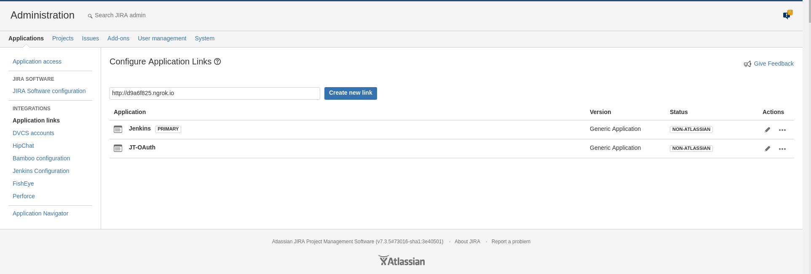
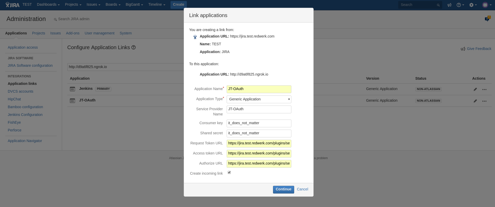
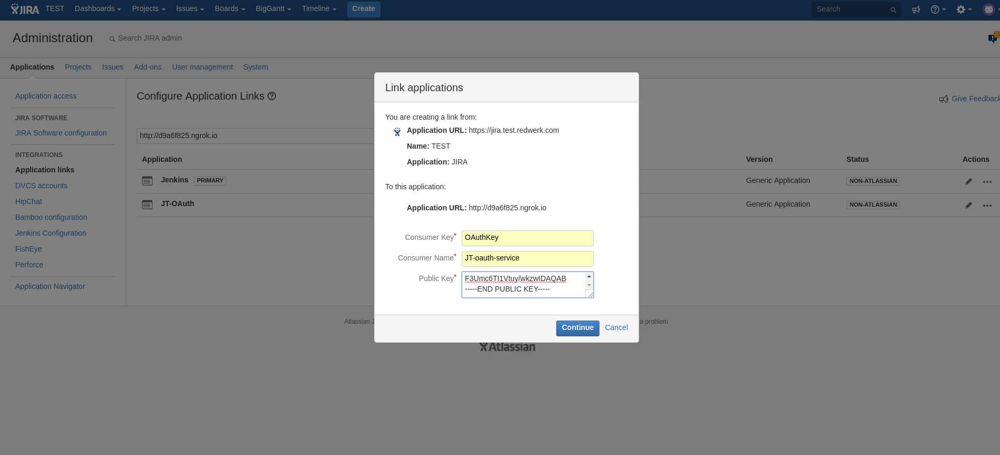

- Создать пользователя **DB_USER** и пароль **DB_PASS** в БД

- Создать базу данных **DB_NAME**, коллекцию для пользователей **DB_USER_COLLECTION** и коллекцию для хостов **DB_HOST_COLLECTION**

- Создать коллекцию **DB_CACHE_COLLECTION** для хранения кэша: `db.DB_CACHE_COLLECTION.createIndex( { "createdAt": 1 }, { expireAfterSeconds: 3600 } )`, *запись удалится через 1 час

- Сгенерировать пару ключей отдельно для каждого хоста, с которым будет работать бот
```
openssl genrsa -out name_privatekey.pem 1024
openssl req -newkey rsa:1024 -x509 -key jira_privatekey.pem -out jira_publickey.cer -days 365
openssl pkcs8 -topk8 -nocrypt -in jira_privatekey.pem -out jira_privatekey.pcks8
openssl x509 -pubkey -noout -in jira_publickey.cer  > name_publickey.pem
```

- Приватный ключ **name_privatekey.pem** положить в папку, абсолютный путь к которой указан в **PRIVATE_KEY_PATH**
- Публичный ключ **name_publickey.pem** положить в папку, абсолютный путь к которой указан в **PUBLIC_KEY_PATH**

- Запустить Flask приложение из корня проекта: `python auth_run.py`

- С правами администратора добавить [Application links](https://developer.atlassian.com/cloud/jira/platform/jira-rest-api-oauth-authentication/)

- Пример добавления с Flask приложением открытым через ngrok:

Добавление ссылки **OAUTH_SERVICE_URL**:



- request_token_url: **JIRA_HOST** + **/plugins/servlet/oauth/request-token**
- access_token_url: **JIRA_HOST** + **/plugins/servlet/oauth/access-token**
- authorize_url: **JIRA_HOST** + **/plugins/servlet/oauth/authorize**
- Обазятельно выбрать **Create incoming link**


- Consumer Key будет сохранено в **DB_HOST_COLLECTION** в настройках хоста
- Запустить или перезапустить бота из корневой папки: `python run.py`
